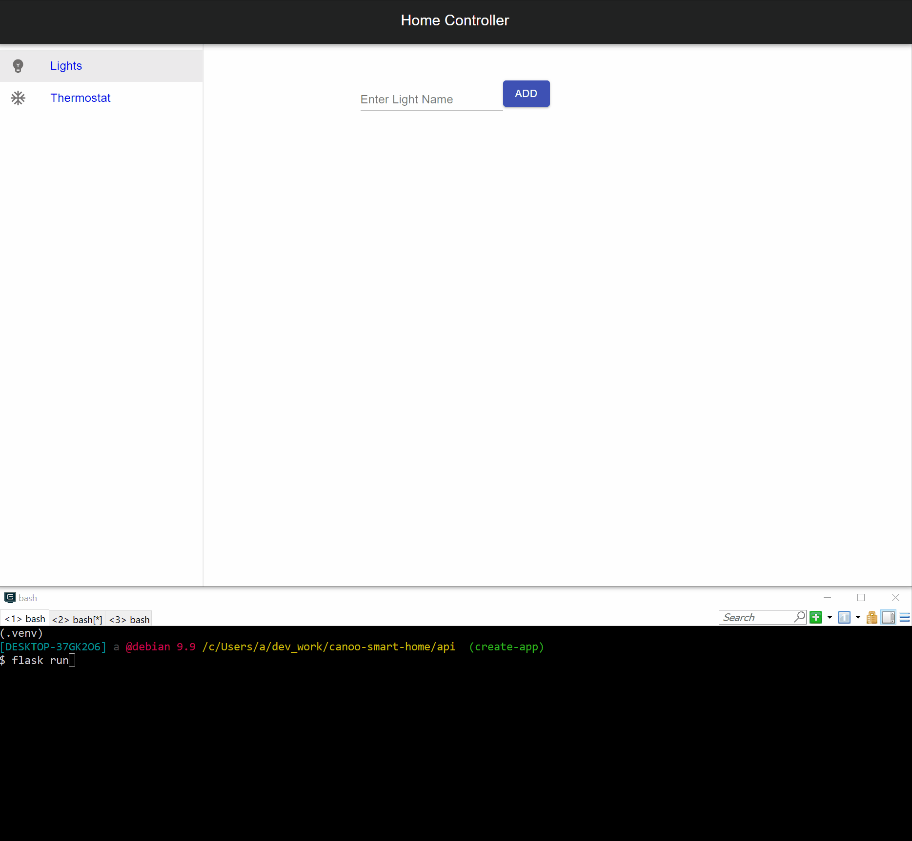

# Smart Home Controller App

## Requirements

- NodeJS
- yarn
- Python3

## Get Started

### Start the backend service

Change directory to the `api` directory.

```shell
cd api
```

Create a virtual environment.

```shell
python3 -m venv .venv
```

Activate the virtual environment.

```shell
source .venv/bin/activate
```

Install dependencies

```shell
pip install -r requirements.txt
```

Start the server

```shell
flask run
```

### Start the front-end

Open a new terminal, and change directory to the `web` directory.

```shell
cd web
```

Install needed libraries.

```shell
yarn install
```

Start server

```shell
yarn start
```

Navigate to `http://localhost:3000/` in your web browser.


